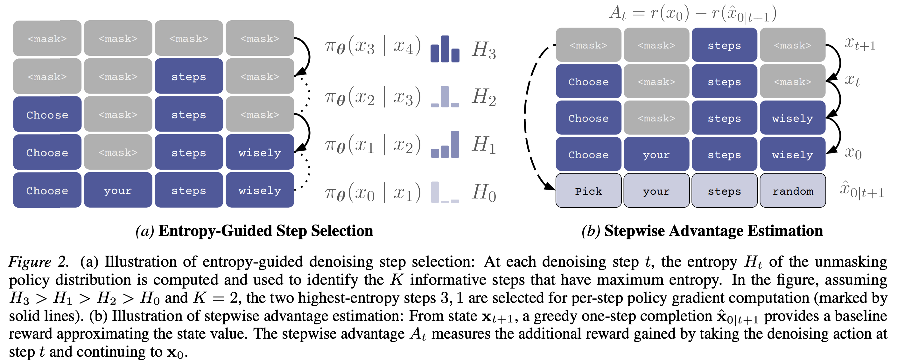
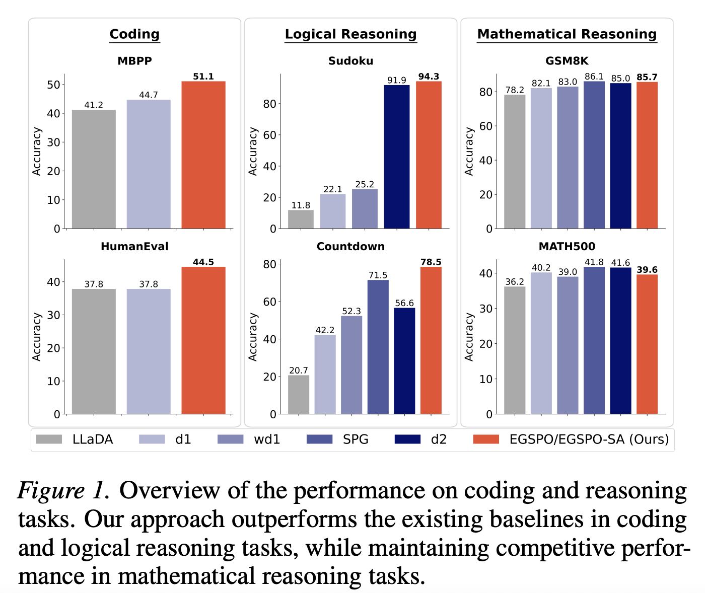

## Paper Overview

**Entropy-Guided Stepwise Policy Optimization with Stepwise Advantages (EGSPO-SA)** introduces a reinforcement learning framework for **diffusion language models (dLLMs)**. Unlike autoregressive LLMs, diffusion models generate sequences through an iterative denoising process, making standard sequence level RL fine-tuning challenging.

We formulate the denoising trajectory as a **finite-horizon Markov decision process** and derive a policy-gradient objective that decomposes across denoising steps. Our method focuses learning on the most informative steps and introduces a lightweight **stepwise advantage estimator** for efficient training.

## Key Contributions

- **Diffusion-MDP formulation** for RL fine-tuning of diffusion language models  
- **Entropy-guided step selection** to identify the most informative denoising steps  
- **EGSPO-SA**, a lightweight stepwise advantage estimator that avoids separate value models  
- Strong empirical results on **coding**, **logical reasoning**, and **mathematical reasoning** benchmarks  

## Overview

  
  

